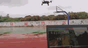

## Bebop-Tracking-Project  
This project is aim to make parrot bebop 2.0 drone can track people autonomously. To communicate with bebop, the bebop_autonomy ros package is used.   

### 1.Environment 
- Ubuntu 16.04   
- ROS (kinetic)   
- ROS package: [bebop_autonomy](http://http://wiki.ros.org/bebop_autonomy)   

### 2.How to use it
I plan to use various recognition and tracking algorithms to achieve the desired functions.
#### Trial 1 Track your face
   

Control the yaw and altitude of the bebop drone to track the face near the front of the UAV.       
**Algorithm:** Cascade-Classifier + PD controller   
**Package:** `bebop_tracker_control` + `face_tracker_pkg`        
**Step:**   
1.Turn on Bebop 2.0, and connect the your computer to the Bebop WIFI.    
2.Running the driver as a Nodelet.   

    $ roslaunch bebop_tools bebop_nodelet_iv.launch
3.Takeoff. You can use a gamepad or the command line:   

    $ rostopic pub --once [namespace]/takeoff std_msgs/Empty    
4.Identify face and publish location information.   

    $ rosrun face_tracker_pkg face_tracker_node.cpp   
5.Track your face.

    $ rosrun bebop_tracker_control bebop_controller_v2.py   

#### Trial 2 Track your body